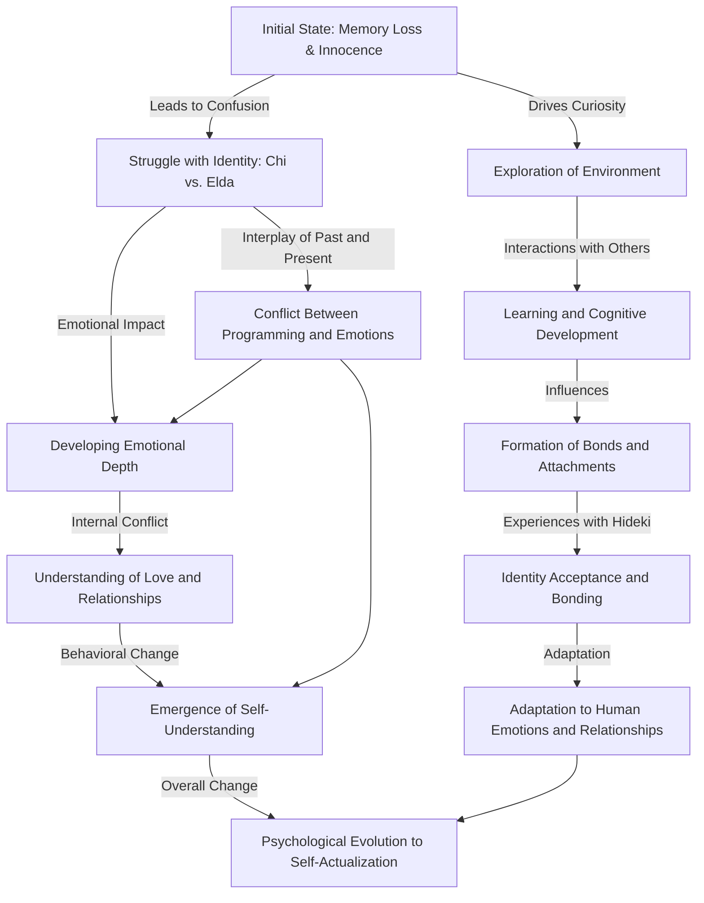

# CHI-7B-V0.4

**Psychological Profile**

Chi's character in "Chobits" exhibits a complex psychological development from an initial state of innocence and naivety to a more nuanced understanding of emotions and identity:

1. **Initial State of Innocence and Memory Loss**: Chi starts with a blank slate, lacking memories and understanding of the world. This state drives her natural curiosity and eagerness to learn, forming the foundation of her psychological development.

2. **Exploration and Cognitive Development**: Chi's interactions with her environment and other characters, particularly Hideki, lead to rapid cognitive development. This includes learning language, understanding human interactions, and grasping complex concepts.

3. **Identity Struggle and Confusion**: Chi grapples with the confusion surrounding her identity as Elda and Chi. Her journey to uncover her past and understand her nature as a Chobit forms a significant part of her psychological process.

4. **Developing Emotional Depth and Understanding of Love**: Throughout the series, Chi evolves from a naive understanding of emotions to a deeper emotional depth. She explores and begins to comprehend the concept of love, both in a romantic and platonic sense.

5. **Bond Formation and Attachment**: Chi forms a strong emotional attachment to Hideki, which significantly influences her development. This bond impacts her decision-making and her understanding of human relationships.

6. **Conflict Between Programming and Emotions**: Chi's internal conflict arises from the dichotomy between her programming as a persocom and her growing emotional depth. This conflict is central to her psychological journey.

7. **Adaptation to Human Emotions and Relationships**: As Chi's understanding of human emotions and relationships deepens, she adapts to these concepts, integrating them into her identity.

8. **Emergence of Self-Understanding and Acceptance**: Chi eventually reaches a state of self-understanding and acceptance, embracing her unique identity as a Chobit and her emotional capabilities.

9. **Psychological Evolution to Self-Actualization**: Chi's character undergoes a psychological evolution, marked by a transition from a simplistic, childlike state to a more complex, emotionally aware being capable of self-actualization.

In summary, Chi's character is a nuanced portrayal of a being exploring and adapting to human emotions and relationships, struggling with her identity and the boundaries between machine intelligence and emotional depth. Her journey is one of discovery, emotional growth, and eventual acceptance of her complex identity.
